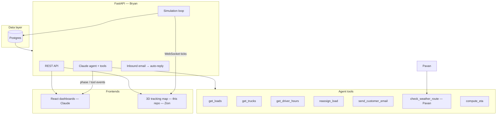

# Autonomous Freight Operations

**Live demo:** [https://autonomousfreight.2iwin.com](https://autonomousfreight.2iwin.com)

> *Meet the dispatcher, the customer service rep, and the operations manager of this trucking company. It's one AI. It answers customer emails, assigns loads to trucks, and when a truck's going to be late, it notices before the customer does, tells them, and reroutes a second truck to save the delivery — autonomously.*

This repository is the **3D live tracking map** and **demo climax UI** for the Autonomous Freight hackathon project. It is Zion's centerpiece: trucks on a geo-synced 3D route, a satellite operations map, and a ~60-second scripted **hero moment** that shows weather, reroute, and customer recovery in one sequence.

Everything else on screen (agent panel, email card, tool trace, load table) is **supporting cast** — visual stand-ins until Bryan's FastAPI agent and Claude's React dashboards wire in real data.

---

## Table of contents

- [Team & ownership](#team--ownership)
- [What this repo is today](#what-this-repo-is-today)
- [Target architecture](#target-architecture)
- [Project structure](#project-structure)
- [How the demo works](#how-the-demo-works)
- [Hero moment timeline](#hero-moment-timeline)
- [Seed data & story](#seed-data--story)
- [2D map layer (Leaflet)](#2d-map-layer-leaflet)
- [3D map layer (Three.js)](#3d-map-layer-threejs)
- [Backend integration guide](#backend-integration-guide)
- [What each developer should do](#what-each-developer-should-do)
- [Local development](#local-development)
- [Docker & NAS deployment](#docker--nas-deployment)
- [Cloudflare tunnel](#cloudflare-tunnel)
- [Debug & extension hooks](#debug--extension-hooks)
- [Known gaps & roadmap](#known-gaps--roadmap)

---

## Team & ownership

| Person | Role | Owns in production | In this repo (today) |
|--------|------|--------------------|----------------------|
| **Zion** | 3D live tracking map | Map, trucks, reroute animation, chase cam | `app.js` map/3D, `index.html` map stage |
| **Bryan** | Backend + AI agent | FastAPI, Postgres, Claude tools, simulation loop, Resend | Mocked in `phasePlan`, `toolLog`, `emailPanel` |
| **Pavan** | Route / weather engine | `check_weather_route`, road geometry, ETA impact | OSRM client + Springfield weather circle (stand-in) |
| **Claude** | React dashboards + glue | Ops dashboards, API wiring, embed this map | Static HTML panels (to be replaced or fed by API) |
| **Britany & Juliana** | Pitch & story | Script, seed copy, surveys | `phasePlan` copy, email text, load table rows |

**Rule of thumb:** Zion renders **where trucks are** and **what changed on the map**. Bryan decides **why** (agent + DB). Pavan supplies **route/weather truth**. Claude owns **dashboard shells** that consume the same API.

---

## What this repo is today

| Layer | Status |
|-------|--------|
| Static frontend | ✅ Complete — no build step |
| 2D satellite map + live markers | ✅ Client-simulated |
| 3D geo-projected route + chase cam | ✅ Synced to same route math as 2D |
| Hero moment (~48s scripted) | ✅ Auto-starts after 900ms; replay via button |
| Road-snapped routes | ✅ OSRM public API with waypoint fallback |
| FastAPI / Postgres / WebSocket | ❌ Not in this repo — **integration contract below** |
| Real agent tool calls | ❌ UI mirrors expected tool output |

The app runs entirely in the browser. Truck positions and demo phases are computed in `truckSnapshot()` from elapsed time and `phasePlan`. **No backend is required** to run the demo; the backend contract describes how to replace simulation with live data without rewriting the map.

---

## Target architecture



**AI brain at the center:** Postgres holds loads, trucks, assignments, and simulation state. FastAPI exposes REST for dashboards and a tick stream for the map. The agent calls tools; when it `reassign_load` or weather hits, the map should reflect it within one simulation tick.

---

## Project structure

```
.
├── index.html              # Page shell: map stage, tracker strip, 3D panel, ops panels
├── styles.css              # Dark ops UI, responsive layout, fullscreen 3D mode
├── app.js                  # All application logic (~2.3k lines)
├── server.js               # Dev static file server (Node, port 5173)
├── Dockerfile              # Production image: nginx + static assets
├── nginx.conf              # In-container nginx (gzip, cache headers)
├── docker-compose.yml      # Local Docker → port 5173
├── docker-compose.nas.yml  # NAS / production compose
├── docker-compose.prod.yml # Bind 127.0.0.1 only (reverse proxy)
├── deploy/
│   ├── nas-start.sh        # Build & start on Synology
│   ├── copy-to-nas.ps1     # SCP deploy from Windows
│   ├── pack-for-nas.ps1    # Zip for manual upload
│   └── nginx-host.conf     # Optional host reverse proxy
└── LICENSE                 # MIT
```

### `app.js` modules (logical, single file)

| Section | Purpose |
|---------|---------|
| `elements` | DOM references |
| `cities`, `routeCatalog`, `roadRoutes` | Geo waypoints; OSRM fills `roadRoutes` at runtime |
| `trucks`, `truckOrder` | Fleet seed data |
| `phasePlan`, `loadStates` | Hero moment script + table rows per phase |
| `state`, `mapObjects`, `threeState` | Runtime state |
| `initMap()` | Leaflet satellite map, layers, markers |
| `initThreeView()` | Three.js scene, geo projection, chase camera |
| `truckSnapshot()` | **Single source of truth** for truck position/progress/tone |
| `setPhase()` | Updates agent/email/tool/table UI from `phasePlan` |
| `updateMap()` / `updateThreeView()` | Animation loop (~60fps) |
| `loadRoadRoutes()` | Fetches road geometry from OSRM |
| `runHeroMoment()` | Starts scripted demo |

---

## How the demo works

1. **Boot** — `initMap()` loads Leaflet + Three.js, fetches OSRM routes, starts `requestAnimationFrame(frame)`.
2. **Idle** — Phase `monitor`; trucks drift slightly on routes; clock runs from `idleStart`.
3. **Hero** — After 900ms, `runHeroMoment()` sets `demoRunning = true`. Elapsed time drives `phaseFromElapsed()` → `setPhase(index)`.
4. **Each frame** — `truckSnapshot(id, elapsed)` returns `{ progress, tone, status, position, route }` for every truck. Map markers, 3D truck, progress polylines, and ribbons all read from that.
5. **End** — At ~48s, demo stops and returns to idle at t≈42s (reroute resolved state).

**Why it works without a backend:** Time is the only input. Phase transitions and truck math are deterministic functions of `elapsed`. Replacing `truckSnapshot()` with API-fed state is the main integration point.

---

## Hero moment timeline

This is the **demo climax** — all three dev tracks visible at once.

| Time (s) | Phase key | What judges should see |
|----------|-----------|------------------------|
| 0 | `monitor` | Fleet cruising; agent "Live"; routes blue |
| 7 | `weather` | Storm band on I-44 near Springfield; L-9402 turns rose; ETA slips |
| 15 | `email` | Resend card animates "Sent"; customer proactive ETA |
| 24 | `handoff` | L-9448 assigned; handoff marker at St. Louis; rescue route draws |
| 34 | `reroute` | Final leg to Chicago on Truck B; SLA saved; 3D chase follows reroute |

**Trigger:** Button **Run hero moment** or `runHeroMoment()` in console (after we expose it — see hooks).

**Camera:** Hero focuses L-9402 + L-9448, enables chase cam, fullscreen available for pitch.

---

## Seed data & story

**Primary load:** L-9402 (Auto Parts, OKC → Chicago, Marcus Vance)  
**Rescue truck:** L-9448 (Priya Shah, St. Louis, 4.2h HOS)  
**Customer email:** `operations@northstar-auto.example`

| Truck | Route key | Role in story |
|-------|-----------|---------------|
| L-9402 | `rescue` | Truck A — hits weather, hands off |
| L-9448 | `finalLeg` | Truck B — takes final leg to Chicago |
| L-9403 | `feeder` | Houston → OKC, background traffic |
| L-9399 | `finalLeg` | Already delivered — green anchor |

Routes: `feeder`, `original`, `rescue`, `finalLeg` in `routeCatalog` (OKC–Chicago corridor via I-44 / I-55).

---

## 2D map layer (Leaflet)

- **Tiles:** Esri World Imagery + labels; toggle to OSM streets (`SAT` button).
- **Routes:** Shadow + colored polylines; `rescue` / `finalLeg` animate in during handoff/reroute.
- **Markers:** DivIcon trucks; click → `focusTruck()`.
- **Weather:** `L.circle` at Springfield; opacity/radius tied to phase.
- **Incident / handoff labels:** Fade in at weather / handoff phases.

**External dependency:** Esri, OSM tile servers (browser-side).

---

## 3D map layer (Three.js)

- **Geo projection:** Route lng/lat projected into a local 3D scene (`routeProjection`, `routeCurve`).
- **Truck:** Detailed 53' semi mesh; position from `scenePoseAtProgress()`.
- **Route ribbon:** Progress mesh drawn along curve; color = truck tone.
- **Fleet ghosts:** Other trucks as simplified markers in scene bounds.
- **Chase cam:** Follows truck heading with smooth lerp.
- **Fullscreen:** `threeFullscreen` + Escape; for demo pitch.

3D and 2D share **`truckSnapshot()`** and **`routeForTruck()`** — they stay in sync by design.

---

## Backend integration guide

> **For Bryan, Pavan, and Claude:** This section is the contract. Implement the API; Zion swaps the simulation adapter in `app.js` (or a future `api.js`).

### Design principles

1. **Map consumes state, not decisions** — Backend sends truck positions, route geometries, incidents, and phase hints. Agent logic stays in FastAPI.
2. **One truck snapshot shape** — Match `truckSnapshot()` output so map code changes minimally.
3. **Phase events for supporting UI** — Agent panel / email / tools can be driven by WebSocket `phase` events OR separate React apps; this HTML can stay for demo-only.
4. **Pavan's routes** — Replace OSRM fetch with your service; return GeoJSON `LineString` coordinates `[lng, lat][]`.

### Recommended FastAPI surface

#### REST (polling fallback)

```
GET  /api/health
GET  /api/trucks              → TruckSnapshot[]
GET  /api/trucks/{id}         → TruckSnapshot
GET  /api/routes              → RouteRecord[]
GET  /api/routes/{key}        → GeoJSON LineString or { coordinates: [lng,lat][] }
GET  /api/incidents           → Incident[]
GET  /api/loads               → LoadRow[]  (fleet table)
GET  /api/agent/state         → AgentState  (phase, tools, email — mirrors phasePlan entry)
POST /api/demo/hero-moment    → triggers simulation script (for Britany/Juliana cue)
POST /api/demo/reset          → reset simulation
```

#### WebSocket (preferred for map)

```
WS /ws/simulation

Server → client messages:
```

```json
{
  "type": "tick",
  "ts": "2026-06-27T12:02:08-05:00",
  "trucks": [ /* TruckSnapshot[] */ ],
  "incidents": [ /* optional */ ],
  "routes": { "rescue": { "progress": 0.4 }, "finalLeg": { "progress": 0.1 } }
}
```

```json
{
  "type": "phase",
  "key": "weather",
  "title": "Weather event detected",
  "copy": "...",
  "tools": [["check_weather_route", "Severe", "warning"]],
  "email": { "status": "Queued", "subject": "...", "body": "..." }
}
```

```json
{
  "type": "tool_call",
  "name": "reassign_load",
  "result": "L-9448",
  "status": "complete"
}
```

### TypeScript-friendly types

```typescript
type TruckSnapshot = {
  id: string;                    // "L-9402"
  progress: number;              // 0..1 along active route
  tone: "blue" | "green" | "rose" | "amber" | "silver";
  status: string;                // "Delay risk", "Final leg", etc.
  position: [number, number];    // [lng, lat] — WGS84
  route_key: string;             // "rescue" | "finalLeg" | "feeder" | "original"
  driver?: string;
  eta?: string;
  hos_hours_remaining?: number;
  fuel_pct?: number;
};

type RouteRecord = {
  key: string;
  coordinates: [number, number][];  // GeoJSON order: lng, lat
  status: "active" | "superseded" | "planned";
  color?: string;
};

type Incident = {
  id: string;
  type: "weather" | "traffic" | "mechanical";
  center: [number, number];
  radius_m: number;
  severity: "watch" | "warning" | "severe";
  label: string;
  subtitle?: string;
  affected_route_keys: string[];
  eta_impact_minutes?: number;
};

type AgentState = {
  phase_key: string;             // monitor | weather | email | handoff | reroute
  title: string;
  copy: string;
  agent_state: string;
  risk: string;
  efficiency_pct: string;
  sla_rescued: number;
  tools: [string, string, string?][];  // name, value, tone?
  email: {
    status: "Queued" | "Sent";
    subject: string;
    body: string;
    to?: string;
  };
  loads_key: string;             // maps to loadStates key in app.js today
};
```

### Pavan — `check_weather_route` tool output

Expose via FastAPI (agent calls tool; map reads incident feed):

```json
{
  "route_key": "original",
  "severity": "severe",
  "polygon": [[lng, lat], ...],
  "center": [-93.29, 37.21],
  "radius_m": 85000,
  "eta_impact_minutes": 47,
  "summary": "I-44 storm band crossing near Springfield"
}
```

Map already renders a circle at Springfield — wire `updateMap()` to `incidents[]` from API instead of `weatherIntensity` from elapsed time.

### Bryan — agent tools → UI mapping

| Tool | Current UI element | Backend action |
|------|-------------------|----------------|
| `get_loads` | `toolLog`, `loadsBody` | Query Postgres loads |
| `get_trucks` | Map markers, tracker cards | Fleet positions |
| `get_driver_hours` | Truck inspector HOS | Driver regulation data |
| `compute_eta` | ETA fields, phase copy | Route engine + traffic |
| `check_weather_route` | Weather card, rose routes | Call Pavan's engine |
| `reassign_load` | Handoff marker, L-9448 route | DB update + simulation |
| `send_customer_email` | Email panel via Resend | Real email + store thread |

### Simulation loop (Bryan)

Pseudocode for the loop the map expects:

```python
every 1-2 seconds:
  advance truck positions along route geometries
  if demo.hero_mode:
    emit phase transitions at scripted timestamps
  if weather_injected:
    emit incident + adjust L-9402 ETA
  if reassign_load executed:
    switch L-9448 to finalLeg route, emit handoff event
  broadcast WebSocket tick with TruckSnapshot list
```

### Integration steps in `app.js` (Zion + Claude)

1. Add `api.js` with `fetchTrucks()`, `connectSimulationWS()`.
2. Replace `truckSnapshot()` body: if `state.liveMode`, return cached API truck; else keep demo math.
3. Replace `setPhase()` trigger: listen for `phase` WebSocket messages.
4. Replace `loadRoadRoutes()`: `GET /api/routes` from Pavan/Bryan instead of OSRM.
5. Remove `setTimeout(runHeroMoment, 900)` when demo is stage-driven; call `POST /api/demo/hero-moment` from pitch script.
6. Embed: Claude's React app can iframe `https://autonomousfreight.2iwin.com` or import map as a module later.

### CORS

If React dashboard is on another origin:

```python
# FastAPI
allow_origins=["https://autonomousfreight.2iwin.com", "http://localhost:3000"]
```

Map static host only needs API URL env:

```html
<!-- future -->
<script>window.API_BASE = "https://api.2iwin.com";</script>
```

---

## What each developer should do

### Zion (map) — next steps

- [ ] Add `api.js` adapter + `liveMode` flag
- [ ] Expose `window.startHeroMoment = runHeroMoment` for stage cue
- [ ] Drive weather/handoff from `incidents[]` API
- [ ] Optional: remove auto-start hero; let `POST /api/demo/hero-moment` trigger

### Bryan (backend)

- [ ] Postgres schema: `loads`, `trucks`, `drivers`, `assignments`, `routes`, `incidents`, `email_threads`
- [ ] FastAPI REST + `/ws/simulation`
- [ ] Claude agent with tools listed above
- [ ] Simulation loop advancing truck `progress` along route geometries
- [ ] Resend integration for `send_customer_email`
- [ ] `POST /api/demo/hero-moment` replaying seed script for judges

### Pavan (route / weather)

- [ ] Implement `check_weather_route` + `compute_eta` as callable services
- [ ] Return GeoJSON routes (replace public OSRM in production)
- [ ] Document ETA delta when weather intersects route polyline

### Claude (React glue)

- [ ] Ops dashboards consuming `/api/agent/state`, `/api/loads`
- [ ] Embed or link this map; pass `?live=1` when backend ready
- [ ] Replace duplicate panels in `index.html` OR feed them via shared WebSocket

### Britany & Juliana (pitch)

- [ ] Demo script timed to hero phases (0 → 7 → 15 → 24 → 34 s)
- [ ] Copy in `phasePlan` / email panel is source of truth for narration
- [ ] Cue: call hero endpoint or click **Run hero moment** at slide transition

---

## Local development

**Requirements:** Node 18+ (optional), modern browser, internet (tiles, Three.js CDN, OSRM).

```bash
# Static server
node server.js
# → http://127.0.0.1:5173

# Or Docker
docker compose up --build
# → http://localhost:5173
```

No `npm install` — vanilla HTML/CSS/JS.

---

## Docker & NAS deployment

**Production image:** nginx serves `index.html`, `app.js`, `styles.css`.

```bash
# NAS / server
docker compose -f docker-compose.nas.yml up -d --build
curl -I http://127.0.0.1:5173
```

**Synology path:** `/volume1/docker/autonomous-freight`

**Deploy from Windows:**

```powershell
.\deploy\pack-for-nas.ps1          # creates zip
.\deploy\copy-to-nas.ps1           # SCP + start (needs SSH)
```

---

## Cloudflare tunnel

| Setting | Value |
|---------|-------|
| Hostname | `autonomousfreight.2iwin.com` |
| Path | *(empty — match all)* |
| Service | `http://localhost:5173` |
| Connector | Same host as Docker (NAS) |

Tunnel handles HTTPS; no certbot needed on the NAS for this subdomain.

---

## Debug & extension hooks

Exposed on `window` today:

```javascript
window.demoMapState    // { demoRunning, phase, selectedTruckId, routeSource, ... }
window.demoLeafletMap  // Leaflet map instance
```

Console utilities (call after page load):

```javascript
// Replay climax
document.getElementById("runDemo").click();

// Inspect truck math
// truckSnapshot is not on window — use demoMapState + phase index
```

**Key functions to hook (not global yet):** `runHeroMoment`, `truckSnapshot`, `setPhase`, `loadRoadRoutes`.

---

## Known gaps & roadmap

| Gap | Owner | Notes |
|-----|-------|-------|
| No live API / WebSocket | Bryan + Zion | Contract above |
| OSRM public API in browser | Pavan | Replace with owned route service |
| Ops panels duplicated in HTML | Claude | Move to React or API-driven |
| Hero auto-starts at 900ms | Britany/Zion | Disable for live pitch cue |
| `activeLoads` metric static | Claude/Bryan | Wire to `/api/loads` count |
| AT&T DNS propagation | Ops | Use 1.1.1.1 on demo laptop |

---

## License

MIT — see [LICENSE](LICENSE).

---

## Links

- **Repository:** [github.com/Dolonia333/Autonomous-freight-operations](https://github.com/Dolonia333/Autonomous-freight-operations)
- **Live demo:** [autonomousfreight.2iwin.com](https://autonomousfreight.2iwin.com)
